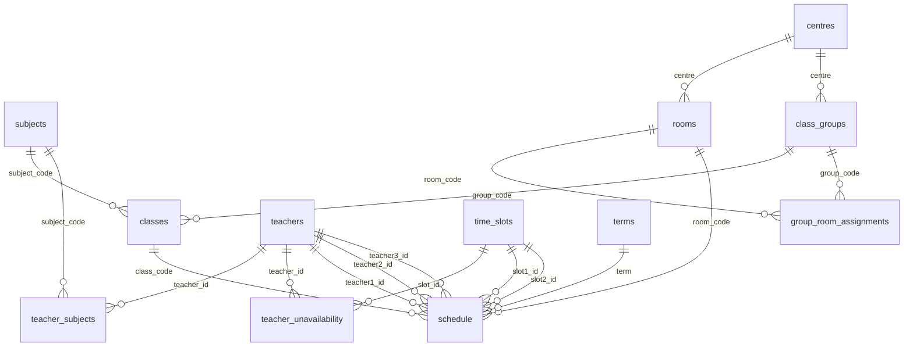

# SQLite-Backed Timetable Scheduling System

## Overview

A complete re-architecture of the timetable tool, grounded in first principles.
The current Excel-only approach conflates data storage, business logic, and
presentation. This plan separates them properly:

- **SQLite** — single-file database that persists all entities and the schedule
- **Flask API** — reads/writes SQLite, runs the scheduler
- **Web UI** — timetable grid + teacher availability form + admin settings
- **Excel export** — generates the existing output format for distribution

The scheduler's job narrows to what it actually is: a **constraint satisfaction
problem** over known entities. Teachers fill their availability once per term.
The admin clicks "Auto-schedule", reviews the grid, adjusts where needed, and
exports.

---

## Problem Statement

The current system has accumulated several design debts:

| Issue | Root Cause |
|-------|-----------|
| Output shows wrong Day/Time/Venue when wrong file is uploaded | No database; system blindly trusts whatever Excel it receives |
| Lec2/3 were missing for two terms | Logic was unclear because "backup" meaning was undocumented |
| Column positions differ across day sheets | Excel format inconsistency, no schema enforcement |
| Business rules are hardcoded in Python | Rules belong in configuration, not code |
| Teacher availability has no input channel | There is no place for teachers to say what times they can do |
| Same-subject same-room rule was ignored | No entity linking class group → room |

The deeper issue: **Excel is being used as a database**, and it is a poor one.
Restructuring around SQLite lets us model the domain correctly and validate
constraints at the data layer.

---

## Domain Model (from first principles)

### Entities

```
Subject     — a course (Chinese Language, Maths…)
Centre      — a physical location (CSW, WT, KT…)
Room        — a classroom at a centre with a fixed capacity
ClassGroup  — e.g. CS1, WT2 — a cohort of students
Class       — a Subject × ClassGroup combination (e.g. DAE101_CS1)
Teacher     — a person who can teach one or more subjects
TimeSlot    — a (Day, StartTime, EndTime) triple
Term        — an academic period (e.g. T2025C)
```

### Relationships

```
Class       belongs to Subject, ClassGroup, Centre
Teacher     has quotas per Subject (primary Lec1, backup Lec2/3)
Teacher     has availability per TimeSlot (default: all available)
Room        belongs to Centre, has capacity
Assignment  links Class → Teacher(s) × Room × TimeSlot(s) for a Term
Rule        configures scheduling preferences (preferred days, restrictions)
```

### Hard Constraints (must not be violated)

| ID | Rule |
|----|------|
| H1 | Room capacity ≥ class student count |
| H2 | A teacher cannot appear in two simultaneous slots |
| H3 | A room cannot host two classes simultaneously |
| H4 | A teacher can only be assigned to a class they are available for |

### Soft Constraints (scored, not enforced)

| ID | Rule |
|----|------|
| S1 | Core subjects (Chinese/English/Maths/CLP/MathsPlus) prefer Mon/Tue/Thu |
| S2 | Same ClassGroup → same Room for all subjects |
| S3 | Same subject at same Centre → same Room |
| S4 | Teacher loading matches their quota |
| S5 | CS1/CS2/CS3 (Police Cadet) may use any day; only 4 subjects allowed |

---

## SQLite Schema

### `db/schema.sql`

```sql
PRAGMA foreign_keys = ON;

CREATE TABLE terms (
    code        TEXT PRIMARY KEY,   -- 'T2025C'
    label       TEXT
);

CREATE TABLE subjects (
    code        TEXT PRIMARY KEY,   -- 'DAE101'
    name_en     TEXT NOT NULL,      -- 'Chinese Language'
    name_cn     TEXT NOT NULL,      -- '中國語文'
    loading_hrs INTEGER NOT NULL    -- 2 or 4
);

CREATE TABLE centres (
    code        TEXT PRIMARY KEY    -- 'CS', 'WT', 'KT'…
);

CREATE TABLE rooms (
    code        TEXT PRIMARY KEY,   -- 'CSW - C1'
    centre      TEXT NOT NULL REFERENCES centres,
    capacity    INTEGER NOT NULL
);

CREATE TABLE class_groups (
    code        TEXT PRIMARY KEY,   -- 'CS1', 'WT2'
    centre      TEXT NOT NULL REFERENCES centres,
    is_police_cadet BOOLEAN DEFAULT 0
);

CREATE TABLE classes (
    code            TEXT PRIMARY KEY,   -- 'DAE101_CS1'
    subject_code    TEXT NOT NULL REFERENCES subjects,
    group_code      TEXT NOT NULL REFERENCES class_groups,
    student_count   INTEGER NOT NULL DEFAULT 0
);

CREATE TABLE teachers (
    id          INTEGER PRIMARY KEY,
    name        TEXT NOT NULL UNIQUE,
    is_net      BOOLEAN DEFAULT 0   -- net/part-time teacher
);

CREATE TABLE teacher_subjects (
    teacher_id      INTEGER NOT NULL REFERENCES teachers,
    subject_code    TEXT NOT NULL REFERENCES subjects,
    lec1_quota      INTEGER DEFAULT 0,
    backup_quota    INTEGER DEFAULT 0,
    PRIMARY KEY (teacher_id, subject_code)
);

CREATE TABLE time_slots (
    id          INTEGER PRIMARY KEY,
    day         TEXT NOT NULL,      -- 'Monday'
    start_time  TEXT NOT NULL,      -- '0900'
    end_time    TEXT NOT NULL,      -- '1100'
    UNIQUE (day, start_time)
);

-- Teacher marks unavailability (default = available for all slots)
CREATE TABLE teacher_unavailability (
    teacher_id  INTEGER NOT NULL REFERENCES teachers,
    slot_id     INTEGER NOT NULL REFERENCES time_slots,
    notes       TEXT,
    PRIMARY KEY (teacher_id, slot_id)
);

-- Room preferred for a class group (same-room rule)
CREATE TABLE group_room_assignments (
    group_code  TEXT NOT NULL REFERENCES class_groups,
    room_code   TEXT NOT NULL REFERENCES rooms,
    term        TEXT NOT NULL REFERENCES terms,
    PRIMARY KEY (group_code, term)
);

-- The schedule: one row per class per term
CREATE TABLE schedule (
    class_code      TEXT NOT NULL REFERENCES classes,
    term            TEXT NOT NULL REFERENCES terms,
    teacher1_id     INTEGER REFERENCES teachers,
    teacher2_id     INTEGER REFERENCES teachers,
    teacher3_id     INTEGER REFERENCES teachers,
    room_code       TEXT REFERENCES rooms,
    slot1_id        INTEGER REFERENCES time_slots,
    slot2_id        INTEGER REFERENCES time_slots,
    PRIMARY KEY (class_code, term)
);

-- Configurable scheduling rules (not hardcoded in Python)
CREATE TABLE scheduling_rules (
    id          INTEGER PRIMARY KEY,
    rule_type   TEXT NOT NULL,      -- 'PREFERRED_DAYS', 'RESTRICTED_SUBJECTS'
    subject_codes TEXT,             -- JSON array or NULL
    group_codes TEXT,               -- JSON array or NULL
    value       TEXT NOT NULL,      -- JSON value
    description TEXT
);

-- Seed: standard time slots
INSERT INTO time_slots (day, start_time, end_time) VALUES
    ('Monday',    '0900', '1100'),
    ('Monday',    '1100', '1300'),
    ('Monday',    '1400', '1600'),
    ('Monday',    '1600', '1800'),
    ('Tuesday',   '0900', '1100'),
    ('Tuesday',   '1100', '1300'),
    ('Tuesday',   '1400', '1600'),
    ('Tuesday',   '1600', '1800'),
    ('Wednesday', '0900', '1100'),
    ('Wednesday', '1100', '1300'),
    ('Wednesday', '1400', '1600'),
    ('Wednesday', '1600', '1800'),
    ('Thursday',  '0900', '1100'),
    ('Thursday',  '1100', '1300'),
    ('Thursday',  '1400', '1600'),
    ('Thursday',  '1600', '1800'),
    ('Friday',    '0900', '1100'),
    ('Friday',    '1100', '1300'),
    ('Friday',    '1400', '1600'),
    ('Friday',    '1600', '1800');

-- Seed: business rules from doc
INSERT INTO scheduling_rules (rule_type, subject_codes, group_codes, value, description)
VALUES
    ('PREFERRED_DAYS',
     '["DAE101","DAE102","DAE103","DAE106","DAE108"]',
     NULL,
     '["Monday","Tuesday","Thursday"]',
     'Core subjects prefer Mon/Tue/Thu'),
    ('POLICE_CADET_DAYS',
     NULL,
     '["CS1","CS2","CS3"]',
     '["Monday","Tuesday","Wednesday","Thursday","Friday"]',
     'Police Cadet classes may use any day'),
    ('POLICE_CADET_SUBJECTS',
     NULL,
     '["CS1","CS2","CS3"]',
     '["DAE101","DAE102","DAE103","DAE106"]',
     'Police Cadet classes: no MathsPlus');
```

---

## ERD



---

## Implementation Phases

### Phase 1 — Database Foundation

**Goal:** SQLite database created and seeded from existing Excel.

**Files:**
- `db/schema.sql` — full schema as above
- `db/migrate_from_excel.py` — one-time migration script

**Migration logic (`migrate_from_excel.py`):**
```python
# Reads Planning for Timetable.xlsx
# Populates: subjects, centres, rooms, class_groups, classes,
#            teachers, teacher_subjects, schedule (T2025C reference)
# Handles known data issues:
#   - Mercury Lee CLP=60 → cap at 20
#   - Subject name mismatches (MathsPlus, Career and Life Learning)
#   - Two-section teacher table (numbered = lec1, unnumbered = backup)
#   - Venue alias mismatches (WT-WT → WT-WT1)
```

**Deliverable:** `db/timetable.db` populated with all T2025C data. Verify with:
```bash
python db/migrate_from_excel.py
sqlite3 db/timetable.db "SELECT COUNT(*) FROM classes;"  -- should be 108
sqlite3 db/timetable.db "SELECT COUNT(*) FROM teachers;" -- should be 28
```

---

### Phase 2 — Scheduler Engine

**Goal:** Constraint-based scheduler that reads from SQLite and writes assignments back.

**File:** `scheduler.py`

**Algorithm:**

```
FUNCTION auto_schedule(term):
    classes ← all classes (ordered by student_count DESC, loading_hrs DESC)
    room_assignments ← assign_rooms(classes)  # one room per class_group
    
    FOR each class IN classes:
        eligible_slot_pairs ← valid_slot_pairs(class.subject.loading_hrs)
        preferred_days ← get_preferred_days(class)  # from scheduling_rules
        
        FOR (slot1, slot2) IN preferred_days_first(eligible_slot_pairs):
            teacher ← find_available_teacher(class.subject, slot1, slot2, term)
            room ← room_assignments[class.group_code]
            
            IF teacher AND NOT room_conflict(room, slot1, slot2, term):
                assign(class, teacher, room, slot1, slot2, term)
                BREAK
        
        IF not assigned:
            flag_for_manual_review(class)

FUNCTION assign_rooms(classes):
    # Group by class_group, find largest room at correct centre
    # Enforces S2: same group → same room
    FOR each group IN unique_groups(classes):
        max_students ← max(c.student_count for c in group)
        room ← largest_room_at_centre(group.centre, min_capacity=max_students)
        room_assignments[group.code] ← room
    RETURN room_assignments
```

**Key SQL queries used by scheduler:**
```sql
-- Find available teachers for a subject at a given pair of slots
SELECT t.id, t.name, ts.lec1_quota
FROM teachers t
JOIN teacher_subjects ts ON t.id = ts.teacher_id
WHERE ts.subject_code = ?
  AND ts.lec1_quota > 0
  AND t.id NOT IN (
      SELECT teacher1_id FROM schedule
      WHERE term = ? AND (slot1_id = ? OR slot2_id = ? OR slot1_id = ? OR slot2_id = ?)
  )
  AND t.id NOT IN (
      SELECT teacher_id FROM teacher_unavailability
      WHERE slot_id IN (?, ?)
  )
ORDER BY ts.lec1_quota DESC;
```

**Deliverable:** `scheduler.py` — callable as `auto_schedule(term)` and from API.

---

### Phase 3 — Flask API (v2)

**Goal:** Replace current direct-file API with SQLite-backed endpoints.

**File:** `api/index.py` (refactored)

**Endpoints:**

| Method | Path | Description |
|--------|------|-------------|
| `GET` | `/` | Serve web UI |
| `GET` | `/api/schedule/:term` | Get full schedule as JSON |
| `POST` | `/api/schedule/auto` | Run auto-scheduler for a term |
| `PATCH` | `/api/schedule/:class_code` | Update one class assignment (manual override) |
| `GET` | `/api/teachers` | List all teachers + availability |
| `POST` | `/api/teachers/:id/availability` | Teacher submits unavailability |
| `GET` | `/api/rooms` | List rooms |
| `GET` | `/api/classes` | List classes |
| `POST` | `/api/export/:term` | Generate and download Excel output |
| `POST` | `/api/migrate` | One-time: import from uploaded Excel |

**No more BytesIO gymnastics.** The database is the source of truth. Excel upload
is only for the initial migration (or if admin wants to re-import a new term's
class list).

---

### Phase 4 — Web UI (v2)

**Goal:** Three-page interface replacing the current single-page upload tool.

**File:** `public/index.html` (expanded, or split into multiple pages)

#### Page 1: Timetable Grid (Admin — main working view)

```
┌─────────────────────────────────────────────────────────┐
│ Term: T2025C ▼   Filter: All subjects ▼   [Auto-Schedule]│
├────────┬──────────┬──────────┬──────────┬──────────┬────┤
│ Room   │ Mon 0900 │ Mon 1100 │ Mon 1400 │ Mon 1600 │ …  │
├────────┼──────────┼──────────┼──────────┼──────────┼────┤
│CSW-C1  │DAE102_CS4│DAE102_CS4│          │          │    │
│        │Ms.Elise  │Ms.Elise  │          │          │    │
├────────┼──────────┼──────────┼──────────┼──────────┼────┤
│CSW-C2  │DAE101_CS2│DAE101_CS2│DAE103_CS2│          │    │
│        │Mr.Chau   │Mr.Chau   │Mr.Wong   │          │    │
├────────┴──────────┴──────────┴──────────┴──────────┴────┤
│ [⚠ 3 classes unassigned]  [Export Excel]                │
└─────────────────────────────────────────────────────────┘
```

- Click any cell → edit assignment (teacher/room/time)
- Red cells = constraint violation
- Yellow cells = manual override (differs from auto-schedule)
- "Auto-Schedule" button → calls `/api/schedule/auto`
- "Export Excel" → calls `/api/export/:term`

#### Page 2: Teacher Availability (Teachers fill this)

```
┌──────────────────────────────────────────────────────┐
│ Teacher: [Select ▼]                                  │
├──────────┬────┬────┬────┬────┬────┬────┬────┬────┬──┤
│          │Mon │Mon │Mon │Mon │Tue │Tue │ …  │Fri │  │
│          │0900│1100│1400│1600│0900│1100│    │1600│  │
├──────────┼────┼────┼────┼────┼────┼────┼────┼────┼──┤
│Available │ ✓  │ ✓  │ ✗  │ ✗  │ ✓  │ ✓  │    │ ✓  │  │
└──────────┴────┴────┴────┴────┴────┴────┴────┴────┴──┘
[Save Availability]
```

Simple toggle grid. Default = all available. Teacher clicks to mark unavailable.

#### Page 3: Settings / Admin

- View/edit rooms, teachers, subjects, class groups
- Upload new term's class list (Excel → database migration)
- View scheduling rules

---

### Phase 5 — Excel Export

**Goal:** Generate the existing Excel output format from the database.

**File:** `export.py`

Logic is identical to the existing `write_output_wb`, but reads from SQLite
instead of ClassAssignment objects. The `schedule` table JOIN with `classes`,
`teachers`, `rooms`, `time_slots` produces exactly what `write_output_wb` needs.

**Deliverable:** `POST /api/export/:term` streams a filled `Timetable_Output.xlsx`.

---

## File Structure

```
09_timetable/
├── db/
│   ├── schema.sql               # SQLite schema + seed data
│   ├── migrate_from_excel.py    # One-time migration
│   └── timetable.db             # SQLite database (gitignored)
├── api/
│   ├── index.py                 # Flask app (v2)
│   └── scheduler.py             # Constraint scheduler
├── export.py                    # Excel export
├── public/
│   ├── index.html               # Main app shell
│   ├── timetable.js             # Grid view + interactions
│   ├── availability.js          # Teacher availability form
│   └── style.css                # Shared styles
├── Planning for Timetable.xlsx  # Source of truth for migration
├── requirements.txt             # + sqlite3 (stdlib), remove openpyxl scheduler dep
├── vercel.json
└── .gitignore                   # timetable.db, Timetable_Output.xlsx
```

---

## Acceptance Criteria

### Functional
- [ ] `python db/migrate_from_excel.py` populates SQLite with all T2025C data (108 classes, 28 teachers, 30 rooms)
- [ ] `POST /api/schedule/auto` assigns Lec1/2/3 + room + time slots to all 108 classes with 0 hard constraint violations
- [ ] Same ClassGroup always uses the same room across all subjects
- [ ] Teacher unavailability is respected (no assignment during marked-unavailable slots)
- [ ] Grid view shows all rooms × time slots with colour-coded assignments
- [ ] Teacher can update availability via Page 2 without touching any code or Excel
- [ ] Admin can manually override any cell in the grid
- [ ] `POST /api/export/:term` generates valid `.xlsx` matching existing format
- [ ] Wrong-file protection: if uploaded Excel has no `Class list answer` data, system shows clear error before attempting migration

### Non-Functional
- [ ] Auto-schedule completes in < 3 seconds for 108 classes
- [ ] Web UI works on Chrome/Edge desktop
- [ ] SQLite database is < 1 MB (fit for Vercel deployment as bundled asset)
- [ ] All existing hard constraints (H1-H4) enforced at database query level, not just Python logic

---

## Risks & Mitigations

| Risk | Mitigation |
|------|-----------|
| Vercel serverless has no persistent filesystem for SQLite | Bundle `timetable.db` as a static asset in deployment; for writes, use Vercel KV or Turso (SQLite-over-HTTP). For v1, use local-only mode (no cloud persistence needed for school internal tool). |
| Teacher availability data not collected in time | Default = all available; system works without availability data. Availability is additive, not blocking. |
| Same-room assignment conflicts (room already occupied) | Assign rooms first, then schedule times. If a room is needed for 2 class groups at the same time, flag for manual review. |
| Migration data quality (Mercury Lee CLP=60, venue mismatches) | Migration script has explicit data-cleaning rules; test run produces a validation report before committing to DB. |

---

## Key Decisions

1. **SQLite over PostgreSQL/MySQL**: School internal tool, single user at a time, no need for multi-user concurrent writes. SQLite is simpler to deploy and backup (single file).

2. **Rules in database, not code**: `scheduling_rules` table means the Mon/Tue/Thu preference and CS1-3 special rules can be changed without touching Python.

3. **Room assignment separate from time assignment**: Assign one room per ClassGroup first (largest available at centre), then schedule time slots. This cleanly enforces the "same subject same room" rule.

4. **Teacher availability is opt-in**: Default is all slots available. Teachers only mark exceptions. This means the system works immediately even before anyone fills in availability.

5. **Keep Excel export**: Teachers and admin are familiar with the existing output format. The database is the source of truth; Excel is just a report.

---

## Sources

- Origin plans: `docs/plans/2026-05-05-001-*`, `docs/plans/2026-05-05-002-*`
- Source doc: `Output of weekly timetable.docx` (business rules, data format)
- Source data: `Planning for Timetable.xlsx` (T2025C reference data)
- Prior art: existing `timetable_scheduler.py` (scheduling logic, venue alias map, column position detection)
