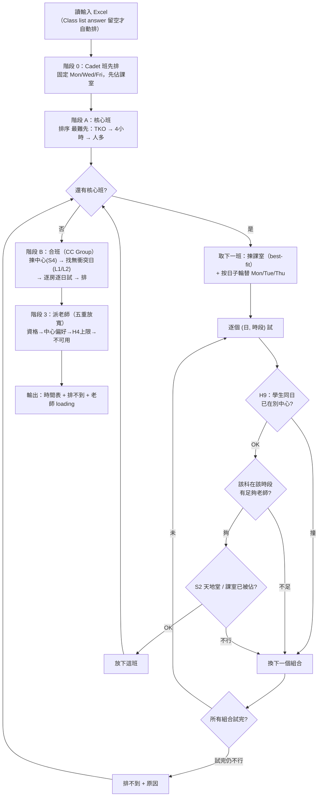

# 排班系統：完整規則與排法說明

> 這份文件讓使用者了解**系統背景**：它依據哪些規則、按什麼次序排班。
> 只需閱讀理解，不需懂電腦。想更改規則或填資料，另見
> `排班規則-同事版.md`（如何向 AI 提出更改）與 `如何填Excel.md`（如何填資料）。

---

## 一、系統在做什麼

輸入一份 Excel（班別、老師、課室、老師不可用時間），系統會**自動為每一班編配**：

- **上課日**（星期幾）
- **時段**（上午／下午哪個時間）
- **課室**
- **老師**

並在最後**列出排不到的班及原因**（例如課室不足）。

---

## 二、排法（系統實際怎樣排，詳細）

### 流程圖概覽

以下是每一步的詳細說明。

### 階段 0 — Cadet 班先排
Cadet 班（制服團隊，班代碼結尾是單一英文字母，如 `DAE256_E`）固定用**星期一、三、五**，先佔用課室。
> 💬 **白話：** 制服團隊有固定日子，先幫他們佔好位，其餘班再避開。

### 階段 A — 核心班（排 日 / 時 / 室）
為未合併的班安排。**先排最難排的**（TKO → 4 小時班 → 人數多），並讓同一科的班**分散在不同日子**。
對每一班：先揀課室（best-fit，見下），再按日子輪替（Mon / Tue / Thu），逐個 (日, 時段) 嘗試，每格要通過：
- **H9** — 該班學生同一天沒有在別的中心上課；
- **老師容量** — 該科在該時段有足夠合資格老師（實際指派留待階段 3）；
- **S2 天地堂** — 不造成同半天的大空堂；
- **課室未被佔**。

第一個全過的格就定案；全部試完仍不行 = 排不到（原因：SLOT_ROOM 課室不足 / SLOT_TEACHER 老師不足 / SLOT_H9 學生撞中心）。
> 💬 **白話：** 由最難搞的班開始，逐格試「學生、老師、課室」是否都配合得到，配合就放下。

### 階段 B — 合班（CC Group）
有填 CC Group 的班合併成一堂：揀學生最多的中心（S4）→ 找一日該組學生無跨中心衝突（L1，不行換中心 L2）→ **逐間夠大的房、逐個可行日子試** → 排下。
> 💬 **白話：** 要合併的班，找一個大家都有空、又有大房的日子，一起上。

### 階段 3 — 派老師（五重放寬）
為每班找主教老師（+後備），由嚴到寬：資格 → 中心偏好 → 每週上限 6（H4）→ 不可用時間；每次放寬都留下提醒（詳見第六節）。
> 💬 **白話：** 先按最理想的條件找老師，找不到就一步步放寬，並記下提醒。

### 選課室的方式（best-fit）
每班先看自己組別的「本組房」（例如 `CS6` → CSW 的 `C6` 室）；若本組房**坐不下**，就改選**大小合適、剛好夠坐**的課室，不浪費大房。

---

## 三、硬性規則（一定遵守，不會違反）

| 編號 | 規則 |
|---|---|
| H1 | 同一老師同一時段不可教兩班 |
| H2 | 同一課室同一時段不可排兩班（合併班例外，見第五節） |
| H3 | 學生在自己所屬校區上課（例外：沙田 TS 可借用屯門 TM 的課室） |
| H5 | 合併班必須**同科、同語言** |
| H6 | 將軍澳（TKO）的班必須**10:00 或之後**開始 |
| H7 | 老師必須有教該科的資格 |
| H8 | 老師同一天只在一個中心；跨中心只限車程 **≤90 分鐘**，超過則不可 |
| H9 | 學生同一天只在一個中心（例外：長沙灣↔深水埗、荃灣↔長沙灣／深水埗） |

**課室容量：** 預設情況下，系統**不會**把班排入坐不下的課室（例如 33 人不會排入 25 座房），以**報名人數**為準。
**但要注意退修：** 學期中通常有學生退修，實際人數會少於報名數。若因嚴格容量令班「差幾個位」排不到，可設定一個**容量寬容度**（`capacity_tolerance`，假設會退修多少個），讓系統容許座位略少於報名數的課室。預設為 **0（嚴格）**，可按需由設定調整。

---

## 四、軟性規則（盡量遵守，必要時放寬並提醒）

| 編號 | 規則 |
|---|---|
| H4 | 老師每週上課量**軟性上限 6 班**——可超過，只提醒（標紅），**不阻止**（見第六節）。編號雖用 H，但實為軟性。 |
| S1a | 尊重老師填報的不可用時間；逼不得已才排入，並標示提醒 |
| S1b | 尊重老師的中心偏好；逼不得已才排到非偏好中心，並標示提醒 |
| S2 | 學生同一個上午或下午不應有「天地堂」（中間隔太遠的空堂） |
| S3 | 同一科的多個班盡量**分散在不同日子** |
| S4 | 合併班優先安排在**學生人數最多**的那個中心上課 |

---

## 五、合併班（CC Group）

**用途：** 把人數少的班合併成一堂，一起上、共用一間課室，節省課室。

**規則：**
- 在 Excel 的「CC Group」欄，同組要合併的班填**相同標籤**（例：`CC-DAE106-1`）。
- 必須**同科**；合併後**總人數要容納得下一間課室**（大班無法合併）。
- 系統怎樣排合併班：
  - **L1** — 找一個「該組所有學生當天都沒有在別的中心上課」的日子；
  - **L2** — 若某中心找不到，換下一個中心；
  - 會**逐個可行日子、逐間夠大的課室**嘗試，直到排得下；全部試完仍不行才報「排不到」。

---

## 六、老師編配（五重放寬）

系統為每班找主教老師，由最嚴格開始，逐步放寬，每次放寬都會**留下提醒**：

| 步驟 | 放寬什麼 | 提醒 |
|---|---|---|
| 1 | 全部條件都符合 | — |
| 2 | 放寬科目配額 | — |
| 3 | 放寬中心偏好 | S1b |
| 4 | 放寬每週上限 6 班 | **H4：老師超過建議的 6 班** |
| 5 | 放寬不可用時間 | S1 |

**重點：** 老師上課量**可以超過 6**，只會標示提醒（紅色），**永不阻止排班**。
後備老師（第二、三教）不計入上課量。

---

## 七、上課日與時段

- **DAE 科目：** 只排**星期一、二、四**（不排三、五）。
- **Cadet 班：** 星期一、三、五。
- **時段：** 一般中心 09:00–18:00，分 2 小時一節；4 小時的班佔**同上午或同下午的兩節連堂**。
  將軍澳（TKO）因空調成本，10:00 之後才開始（最晚到 19:00）。

---

## 八、中心（校區）代碼

WT=黃大仙、SSP=深水埗、CSW=長沙灣、KT=觀塘、TKO=將軍澳、TS=沙田、FL=粉嶺、TW=荃灣、TM=屯門。

---

## 九、英文科（DAE102）Net 老師

- Net 老師（Peter Barrett、Chris Hon）每個非豁免英文班**每學期至少 1 個 Net 時段**。
- **Net 老師同日跨中心車程上限：30 分鐘。**
  意思是：如果 Net 老師同一天要去多過一個中心，兩個中心之間的車程**不可超過 30 分鐘**，
  否則系統不會這樣安排。
  **為什麼是 30（比一般老師的 90 更緊）：** 是為了**避免 Net 老師一天內趕太遠的路**。
  數字愈大（例如 90），老師可被派得愈遠、能覆蓋愈多班，但**車程更趕**；
  數字愈細，老師走得愈少、愈不趕，但**較難覆蓋所有英文班**（可能有班配不到 Net 老師）。
  目前定在 30，是取「不讓老師太趕」為優先。
- 豁免組別（不需 Net）：CS1、CS2、CS3、CS7。

---

## 十、系統會輸出什麼

- 完整時間表（日／週·課室／週·老師／月檢視），合併班會顯示其**原本各班**。
- **排不到的班 + 原因**（課室不足／老師不足等）。
- **老師上課量**（超過 6 標紅提醒）。
- 15 週學期曆（標示公眾假期）。

---

*技術對應：`docs/system-modules.md`（各規則在程式的位置）、可調設定：`config/rules.json`。*
